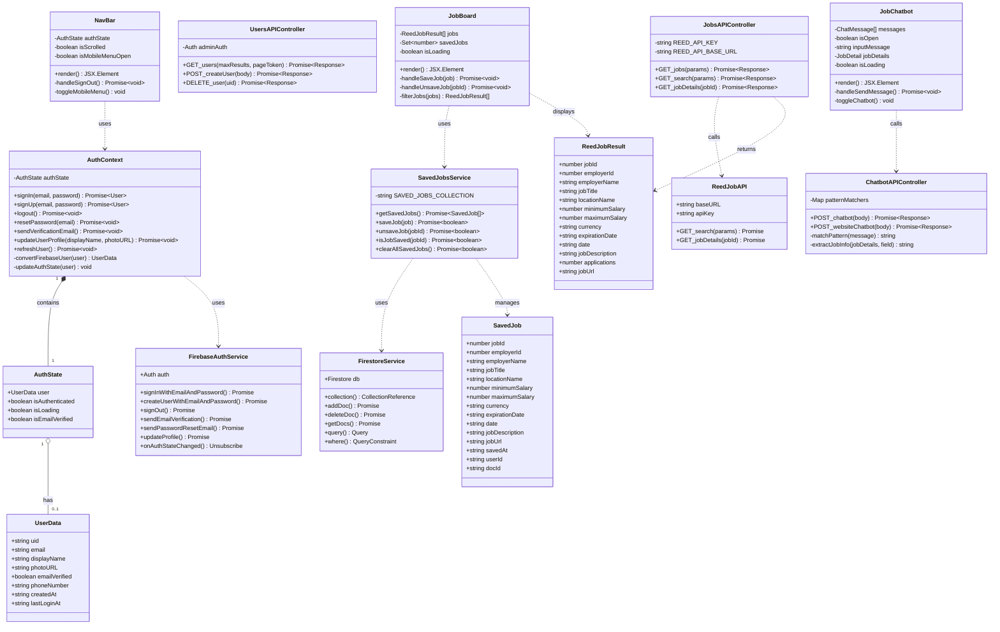

# Hirely - UML Class Diagram

## Document Information
- **Project Name:** Hirely
- **Version:** 1.0
- **Last Updated:** 2025-12-10
- **Diagram Type:** UML Class Diagram

---

## Table of Contents
1. [Overview](#1-overview)
2. [Core Domain Models](#2-core-domain-models)
3. [Authentication Module](#3-authentication-module)
4. [Job Management Module](#4-job-management-module)
5. [API Service Classes](#5-api-service-classes)
6. [UI Component Classes](#6-ui-component-classes)
7. [External Service Integrations](#7-external-service-integrations)
8. [Class Relationships Diagram](#8-class-relationships-diagram)
9. [Detailed Class Specifications](#9-detailed-class-specifications)

---

## 1. Overview

This document provides the complete UML class diagram for the Hirely job portal platform. The architecture follows a modular design with clear separation between:
- **Domain Models** (data structures)
- **Service Classes** (business logic)
- **Context Providers** (state management)
- **UI Components** (presentation layer)
- **API Controllers** (backend endpoints)

### Architecture Layers

```
┌─────────────────────────────────────────────────┐
│           Presentation Layer (UI)               │
│    (React Components, Pages, Layouts)           │
└─────────────────┬───────────────────────────────┘
                  │
┌─────────────────▼───────────────────────────────┐
│         Application Layer (Context)             │
│    (AuthContext, State Management)              │
└─────────────────┬───────────────────────────────┘
                  │
┌─────────────────▼───────────────────────────────┐
│        Business Logic Layer (Services)          │
│    (SavedJobsService, API Routes)               │
└─────────────────┬───────────────────────────────┘
                  │
┌─────────────────▼───────────────────────────────┐
│     Data Access Layer (Firebase, Reed API)      │
│    (Firestore, Firebase Auth, External APIs)    │
└─────────────────────────────────────────────────┘
```

---

## 2. Core Domain Models

### 2.1 User Domain

```
┌─────────────────────────────────────────┐
│            «interface»                  │
│             UserData                    │
├─────────────────────────────────────────┤
│ - uid: string                           │
│ - email: string | null                  │
│ - displayName: string | null            │
│ - photoURL: string | null               │
│ - emailVerified: boolean                │
│ - phoneNumber: string | null            │
│ - createdAt: string | null              │
│ - lastLoginAt: string | null            │
└─────────────────────────────────────────┘
```

```
┌─────────────────────────────────────────┐
│            «interface»                  │
│            AuthState                    │
├─────────────────────────────────────────┤
│ - user: UserData | null                 │
│ - isAuthenticated: boolean              │
│ - isLoading: boolean                    │
│ - isEmailVerified: boolean              │
└─────────────────────────────────────────┘
```

```
┌─────────────────────────────────────────┐
│            «interface»                  │
│            UserInfo                     │
├─────────────────────────────────────────┤
│ + uid: string                           │
│ + email: string                         │
│ + displayName: string | null            │
│ + photoURL: string | null               │
│ + emailVerified: boolean                │
│ + creationTime: string                  │
│ + lastSignInTime: string                │
└─────────────────────────────────────────┘
```

```
┌─────────────────────────────────────────┐
│            «interface»                  │
│       CreateUserRequest                 │
├─────────────────────────────────────────┤
│ + email: string                         │
│ + password: string                      │
│ + displayName?: string                  │
│ + emailVerified?: boolean               │
└─────────────────────────────────────────┘
```

### 2.2 Job Domain

```
┌─────────────────────────────────────────┐
│            «interface»                  │
│             SavedJob                    │
├─────────────────────────────────────────┤
│ + jobId: number                         │
│ + employerId: number                    │
│ + employerName: string                  │
│ + jobTitle: string                      │
│ + locationName: string                  │
│ + minimumSalary?: number                │
│ + maximumSalary?: number                │
│ + currency?: string                     │
│ + expirationDate: string                │
│ + date: string                          │
│ + jobDescription: string                │
│ + jobUrl: string                        │
│ + savedAt: string                       │
│ + userId?: string                       │
│ + docId?: string                        │
└─────────────────────────────────────────┘
```

```
┌─────────────────────────────────────────┐
│            «interface»                  │
│          ReedJobResult                  │
├─────────────────────────────────────────┤
│ + jobId: number                         │
│ + employerId: number                    │
│ + employerName: string                  │
│ + jobTitle: string                      │
│ + locationName: string                  │
│ + minimumSalary: number                 │
│ + maximumSalary: number                 │
│ + currency: string                      │
│ + expirationDate: string                │
│ + date: string                          │
│ + jobDescription: string                │
│ + applications: number                  │
│ + jobUrl: string                        │
└─────────────────────────────────────────┘
```

```
┌─────────────────────────────────────────┐
│            «interface»                  │
│         ReedApiResponse                 │
├─────────────────────────────────────────┤
│ + totalResults: number                  │
│ + results: ReedJobResult[]              │
└─────────────────────────────────────────┘
```

```
┌─────────────────────────────────────────┐
│            «interface»                  │
│          SearchParams                   │
├─────────────────────────────────────────┤
│ + keywords?: string                     │
│ + locationName?: string                 │
│ + distanceFromLocation?: number         │
│ + permanent?: boolean                   │
│ + contract?: boolean                    │
│ + temp?: boolean                        │
│ + partTime?: boolean                    │
│ + fullTime?: boolean                    │
│ + minimumSalary?: number                │
│ + maximumSalary?: number                │
│ + postedByRecruitmentAgency?: boolean   │
│ + postedByDirectEmployer?: boolean      │
│ + graduate?: boolean                    │
│ + resultsToTake?: number                │
│ + resultsToSkip?: number                │
└─────────────────────────────────────────┘
```

### 2.3 Chatbot Domain

```
┌─────────────────────────────────────────┐
│            «interface»                  │
│          ChatMessage                    │
├─────────────────────────────────────────┤
│ + id: string                            │
│ + role: 'user' | 'assistant'            │
│ + content: string                       │
│ + timestamp: Date                       │
└─────────────────────────────────────────┘
```

```
┌─────────────────────────────────────────┐
│            «interface»                  │
│         ChatbotRequest                  │
├─────────────────────────────────────────┤
│ + message: string                       │
│ + jobDetails?: JobDetail                │
└─────────────────────────────────────────┘
```

```
┌─────────────────────────────────────────┐
│            «interface»                  │
│         ChatbotResponse                 │
├─────────────────────────────────────────┤
│ + response: string                      │
└─────────────────────────────────────────┘
```

---

## 3. Authentication Module

### 3.1 AuthContext Class

```
┌──────────────────────────────────────────────────┐
│                «Context Provider»                │
│                  AuthContext                     │
├──────────────────────────────────────────────────┤
│ - authState: AuthState                           │
│ - children: ReactNode                            │
├──────────────────────────────────────────────────┤
│ + signIn(email: string, password: string):       │
│     Promise<User>                                │
│ + signUp(email: string, password: string):       │
│     Promise<User>                                │
│ + logout(): Promise<void>                        │
│ + resetPassword(email: string): Promise<void>    │
│ + sendVerificationEmail(): Promise<void>         │
│ + updateUserProfile(displayName?: string,        │
│     photoURL?: string): Promise<void>            │
│ + refreshUser(): Promise<void>                   │
│ - convertFirebaseUser(firebaseUser: User):       │
│     UserData                                     │
│ - updateAuthState(firebaseUser: User | null):    │
│     void                                         │
└──────────────────────────────────────────────────┘
```

### 3.2 AuthContextValue Interface

```
┌─────────────────────────────────────────┐
│            «interface»                  │
│         AuthContextValue                │
├─────────────────────────────────────────┤
│ + authState: AuthState                  │
│ + signIn: (email: string,               │
│     password: string) => Promise<User>  │
│ + signUp: (email: string,               │
│     password: string) => Promise<User>  │
│ + logout: () => Promise<void>           │
│ + resetPassword: (email: string) =>     │
│     Promise<void>                       │
│ + sendVerificationEmail: () =>          │
│     Promise<void>                       │
│ + updateUserProfile: (displayName?:     │
│     string, photoURL?: string) =>       │
│     Promise<void>                       │
│ + refreshUser: () => Promise<void>      │
└─────────────────────────────────────────┘
```

### 3.3 Hook: useAuth()

```
┌─────────────────────────────────────────┐
│              «Custom Hook»              │
│                useAuth                  │
├─────────────────────────────────────────┤
│ + useAuth(): AuthContextValue           │
└─────────────────────────────────────────┘
```

---

## 4. Job Management Module

### 4.1 SavedJobsService Class

```
┌──────────────────────────────────────────────────┐
│                  «Service»                       │
│             SavedJobsService                     │
├──────────────────────────────────────────────────┤
│ - SAVED_JOBS_COLLECTION: string = "savedJobs"    │
├──────────────────────────────────────────────────┤
│ + getSavedJobs(): Promise<SavedJob[]>            │
│ + saveJob(job: Omit<SavedJob, "savedAt" |       │
│     "userId" | "docId">): Promise<boolean>       │
│ + unsaveJob(jobId: number): Promise<boolean>     │
│ + isJobSaved(jobId: number): Promise<boolean>    │
│ + clearAllSavedJobs(): Promise<boolean>          │
└──────────────────────────────────────────────────┘
```

**Method Descriptions:**

- **getSavedJobs()**: Retrieves all saved jobs for the current authenticated user from Firestore
- **saveJob()**: Saves a job to the user's collection, checks for duplicates first
- **unsaveJob()**: Removes a job from the user's saved collection
- **isJobSaved()**: Checks if a specific job is already saved by the user
- **clearAllSavedJobs()**: Removes all saved jobs for the current user

---

## 5. API Service Classes

### 5.1 JobsAPIController

```
┌──────────────────────────────────────────────────┐
│               «API Controller»                   │
│            JobsAPIController                     │
├──────────────────────────────────────────────────┤
│ - REED_API_KEY: string                           │
│ - REED_API_BASE_URL: string                      │
├──────────────────────────────────────────────────┤
│ + GET /api/jobs(params: URLSearchParams):        │
│     Promise<Response>                            │
│ + GET /api/jobs/search(params: SearchParams):    │
│     Promise<Response>                            │
│ + GET /api/jobs/[jobId](jobId: string):          │
│     Promise<Response>                            │
└──────────────────────────────────────────────────┘
```

**Endpoints:**

1. **GET /api/jobs**
   - Query Parameters: keywords, locationName, resultsToTake, resultsToSkip
   - Returns: Array of jobs from Reed API

2. **GET /api/jobs/search**
   - Query Parameters: SearchParams interface
   - Returns: Transformed job results with pagination metadata

3. **GET /api/jobs/[jobId]**
   - Path Parameter: jobId
   - Returns: Single job details

### 5.2 UsersAPIController

```
┌──────────────────────────────────────────────────┐
│               «API Controller»                   │
│            UsersAPIController                    │
├──────────────────────────────────────────────────┤
│ - adminAuth: Auth                                │
├──────────────────────────────────────────────────┤
│ + GET /api/users(maxResults?: number,            │
│     pageToken?: string): Promise<Response>       │
│ + POST /api/users(body: CreateUserRequest):      │
│     Promise<Response>                            │
│ + DELETE /api/users/[uid](uid: string):          │
│     Promise<Response>                            │
└──────────────────────────────────────────────────┘
```

**Endpoints:**

1. **GET /api/users**
   - Query Parameters: maxResults (default: 100), pageToken
   - Returns: { users: UserInfo[], totalUsers, verifiedUsers, unverifiedUsers, pageToken }

2. **POST /api/users**
   - Request Body: CreateUserRequest
   - Returns: { success, data: { uid, email, displayName }, message }

3. **DELETE /api/users/[uid]**
   - Path Parameter: uid
   - Returns: Success/error message

### 5.3 ChatbotAPIController

```
┌──────────────────────────────────────────────────┐
│               «API Controller»                   │
│           ChatbotAPIController                   │
├──────────────────────────────────────────────────┤
│ - patternMatchers: Map<RegExp, Function>         │
├──────────────────────────────────────────────────┤
│ + POST /api/chatbot(body: ChatbotRequest):       │
│     Promise<Response>                            │
│ + POST /api/website-chatbot(body: {message}):    │
│     Promise<Response>                            │
│ - matchPattern(message: string): string | null   │
│ - extractJobInfo(jobDetails: JobDetail,          │
│     field: string): string                       │
└──────────────────────────────────────────────────┘
```

**Endpoints:**

1. **POST /api/chatbot**
   - Request Body: { message: string, jobDetails?: JobDetail }
   - Returns: { response: string }
   - Pattern matching for: salary, location, requirements, company, application

2. **POST /api/website-chatbot**
   - Request Body: { message: string }
   - Returns: { response: string }
   - General website information and guidance

---

## 6. UI Component Classes

### 6.1 Core Layout Components

```
┌──────────────────────────────────────────────────┐
│                «Component»                       │
│                   NavBar                         │
├──────────────────────────────────────────────────┤
│ - authState: AuthState                           │
│ - isScrolled: boolean                            │
│ - isMobileMenuOpen: boolean                      │
├──────────────────────────────────────────────────┤
│ + render(): JSX.Element                          │
│ - handleSignOut(): Promise<void>                 │
│ - toggleMobileMenu(): void                       │
└──────────────────────────────────────────────────┘
```

```
┌──────────────────────────────────────────────────┐
│                «Component»                       │
│                   Footer                         │
├──────────────────────────────────────────────────┤
│ + render(): JSX.Element                          │
└──────────────────────────────────────────────────┘
```

### 6.2 Job Display Components

```
┌──────────────────────────────────────────────────┐
│                «Component»                       │
│                  JobBoard                        │
├──────────────────────────────────────────────────┤
│ - jobs: ReedJobResult[]                          │
│ - savedJobs: Set<number>                         │
│ - isLoading: boolean                             │
│ - filterOptions: FilterState                     │
├──────────────────────────────────────────────────┤
│ + render(): JSX.Element                          │
│ - handleSaveJob(job: ReedJobResult):             │
│     Promise<void>                                │
│ - handleUnsaveJob(jobId: number):                │
│     Promise<void>                                │
│ - filterJobs(jobs: ReedJobResult[]):             │
│     ReedJobResult[]                              │
│ - sortJobs(jobs: ReedJobResult[]):               │
│     ReedJobResult[]                              │
└──────────────────────────────────────────────────┘
```

```
┌──────────────────────────────────────────────────┐
│                «Component»                       │
│            JobSearchComponent                    │
├──────────────────────────────────────────────────┤
│ - searchParams: SearchParams                     │
│ - isLoading: boolean                             │
├──────────────────────────────────────────────────┤
│ + render(): JSX.Element                          │
│ - handleSearch(): Promise<void>                  │
│ - updateSearchParam(key: string, value: any):    │
│     void                                         │
│ - resetSearch(): void                            │
└──────────────────────────────────────────────────┘
```

```
┌──────────────────────────────────────────────────┐
│                «Component»                       │
│         JobSearchResultPage                      │
├──────────────────────────────────────────────────┤
│ - jobs: ReedJobResult[]                          │
│ - totalResults: number                           │
│ - currentPage: number                            │
│ - isLoading: boolean                             │
├──────────────────────────────────────────────────┤
│ + render(): JSX.Element                          │
│ - loadJobs(page: number): Promise<void>          │
│ - handlePageChange(page: number): void           │
└──────────────────────────────────────────────────┘
```

```
┌──────────────────────────────────────────────────┐
│                «Component»                       │
│                JobCategory                       │
├──────────────────────────────────────────────────┤
│ + categories: CategoryInfo[]                     │
├──────────────────────────────────────────────────┤
│ + render(): JSX.Element                          │
│ - handleCategoryClick(category: string): void    │
└──────────────────────────────────────────────────┘
```

### 6.3 Chatbot Components

```
┌──────────────────────────────────────────────────┐
│                «Component»                       │
│                JobChatbot                        │
├──────────────────────────────────────────────────┤
│ - messages: ChatMessage[]                        │
│ - isOpen: boolean                                │
│ - inputMessage: string                           │
│ - jobDetails: JobDetail                          │
│ - isLoading: boolean                             │
├──────────────────────────────────────────────────┤
│ + render(): JSX.Element                          │
│ - handleSendMessage(): Promise<void>             │
│ - toggleChatbot(): void                          │
│ - clearMessages(): void                          │
└──────────────────────────────────────────────────┘
```

```
┌──────────────────────────────────────────────────┐
│                «Component»                       │
│             WebsiteChatbot                       │
├──────────────────────────────────────────────────┤
│ - messages: ChatMessage[]                        │
│ - isOpen: boolean                                │
│ - inputMessage: string                           │
│ - isLoading: boolean                             │
├──────────────────────────────────────────────────┤
│ + render(): JSX.Element                          │
│ - handleSendMessage(): Promise<void>             │
│ - toggleChatbot(): void                          │
└──────────────────────────────────────────────────┘
```

### 6.4 Utility Components

```
┌──────────────────────────────────────────────────┐
│                «Component»                       │
│               CustomButton                       │
├──────────────────────────────────────────────────┤
│ + children: ReactNode                            │
│ + onClick?: () => void                           │
│ + variant?: 'primary' | 'secondary' | 'outline'  │
│ + disabled?: boolean                             │
│ + className?: string                             │
├──────────────────────────────────────────────────┤
│ + render(): JSX.Element                          │
└──────────────────────────────────────────────────┘
```

```
┌──────────────────────────────────────────────────┐
│                «Component»                       │
│                 LogoStrip                        │
├──────────────────────────────────────────────────┤
│ + logos: string[]                                │
├──────────────────────────────────────────────────┤
│ + render(): JSX.Element                          │
└──────────────────────────────────────────────────┘
```

```
┌──────────────────────────────────────────────────┐
│                «Component»                       │
│         GoodLifeCompanySection                   │
├──────────────────────────────────────────────────┤
│ + render(): JSX.Element                          │
└──────────────────────────────────────────────────┘
```

```
┌──────────────────────────────────────────────────┐
│                «Component»                       │
│          TestimonialsSection                     │
├──────────────────────────────────────────────────┤
│ - currentTestimonial: number                     │
│ + testimonials: Testimonial[]                    │
├──────────────────────────────────────────────────┤
│ + render(): JSX.Element                          │
│ - nextTestimonial(): void                        │
│ - prevTestimonial(): void                        │
└──────────────────────────────────────────────────┘
```

---

## 7. External Service Integrations

### 7.1 Firebase Services

```
┌──────────────────────────────────────────────────┐
│            «External Service»                    │
│           FirebaseAuthService                    │
├──────────────────────────────────────────────────┤
│ + auth: Auth                                     │
├──────────────────────────────────────────────────┤
│ + signInWithEmailAndPassword(auth, email,        │
│     password): Promise<UserCredential>           │
│ + createUserWithEmailAndPassword(auth, email,    │
│     password): Promise<UserCredential>           │
│ + signOut(auth): Promise<void>                   │
│ + sendEmailVerification(user): Promise<void>     │
│ + sendPasswordResetEmail(auth, email):           │
│     Promise<void>                                │
│ + updateProfile(user, data): Promise<void>       │
│ + onAuthStateChanged(auth, callback): Unsubscribe│
└──────────────────────────────────────────────────┘
```

```
┌──────────────────────────────────────────────────┐
│            «External Service»                    │
│          FirestoreService                        │
├──────────────────────────────────────────────────┤
│ + db: Firestore                                  │
├──────────────────────────────────────────────────┤
│ + collection(db, path): CollectionReference      │
│ + addDoc(collection, data): Promise<DocumentRef> │
│ + deleteDoc(docRef): Promise<void>               │
│ + getDocs(query): Promise<QuerySnapshot>         │
│ + query(collection, ...constraints): Query       │
│ + where(field, op, value): QueryConstraint       │
│ + Timestamp.now(): Timestamp                     │
└──────────────────────────────────────────────────┘
```

```
┌──────────────────────────────────────────────────┐
│            «External Service»                    │
│         FirebaseAdminService                     │
├──────────────────────────────────────────────────┤
│ + adminAuth: Auth                                │
├──────────────────────────────────────────────────┤
│ + getAdminApp(): App | null                      │
│ + getAdminAuth(): Auth | null                    │
│ + listUsers(maxResults?, pageToken?):            │
│     Promise<ListUsersResult>                     │
│ + createUser(properties): Promise<UserRecord>    │
│ + deleteUser(uid): Promise<void>                 │
│ + getUser(uid): Promise<UserRecord>              │
└──────────────────────────────────────────────────┘
```

### 7.2 External APIs

```
┌──────────────────────────────────────────────────┐
│            «External Service»                    │
│              ReedJobAPI                          │
├──────────────────────────────────────────────────┤
│ + baseURL: string = "https://www.reed.co.uk/api" │
│ + apiKey: string                                 │
├──────────────────────────────────────────────────┤
│ + GET /search(params: SearchParams):             │
│     Promise<ReedApiResponse>                     │
│ + GET /jobs/{jobId}():                           │
│     Promise<ReedJobResult>                       │
└──────────────────────────────────────────────────┘
```

```
┌──────────────────────────────────────────────────┐
│            «External Service»                    │
│         GoogleGenerativeAI                       │
├──────────────────────────────────────────────────┤
│ + apiKey: string                                 │
│ + model: string = "gemini-pro"                   │
├──────────────────────────────────────────────────┤
│ + generateContent(prompt: string):               │
│     Promise<GenerateContentResponse>             │
│   (Planned for future implementation)            │
└──────────────────────────────────────────────────┘
```

---

## 8. Class Relationships Diagram

### 8.1 Complete System Architecture

```
                                    ┌─────────────────┐
                                    │   Next.js App   │
                                    │   (Root Layout) │
                                    └────────┬────────┘
                                             │
                        ┌────────────────────┴────────────────────┐
                        │                                         │
                        ▼                                         ▼
              ┌──────────────────┐                    ┌─────────────────┐
              │   AuthProvider   │◄───────uses────────│   UI Components │
              │   (AuthContext)  │                    │   (Pages/Comps) │
              └────────┬─────────┘                    └────────┬────────┘
                       │                                       │
                       │provides                               │uses
                       │                                       │
                       ▼                                       ▼
         ┌─────────────────────────┐          ┌───────────────────────────┐
         │   AuthContextValue      │          │   SavedJobsService        │
         │   - authState           │          │   - getSavedJobs()        │
         │   - signIn()            │          │   - saveJob()             │
         │   - signUp()            │          │   - unsaveJob()           │
         │   - logout()            │          │   - isJobSaved()          │
         └──────────┬──────────────┘          └───────────┬───────────────┘
                    │                                     │
                    │uses                                 │uses
                    │                                     │
        ┌───────────▼──────────────┐          ┌──────────▼────────────────┐
        │ FirebaseAuthService      │          │   FirestoreService        │
        │ - signInWithEmail...     │          │   - collection()          │
        │ - createUserWithEmail... │          │   - addDoc()              │
        │ - signOut()              │          │   - getDocs()             │
        │ - sendEmailVerification()│          │   - deleteDoc()           │
        └──────────────────────────┘          └───────────────────────────┘


                    ┌──────────────────────────────────────┐
                    │         API Routes Layer             │
                    └──────────┬───────────────────────────┘
                               │
        ┌──────────────────────┼──────────────────────┐
        │                      │                      │
        ▼                      ▼                      ▼
┌───────────────┐    ┌──────────────────┐    ┌─────────────────┐
│ JobsAPI       │    │  UsersAPI        │    │  ChatbotAPI     │
│ Controller    │    │  Controller      │    │  Controller     │
├───────────────┤    ├──────────────────┤    ├─────────────────┤
│ GET /jobs     │    │ GET /users       │    │ POST /chatbot   │
│ GET /search   │    │ POST /users      │    │ POST /website-  │
│ GET /jobs/:id │    │ DELETE /users/:id│    │      chatbot    │
└───────┬───────┘    └────────┬─────────┘    └─────────────────┘
        │                     │
        │uses                 │uses
        │                     │
        ▼                     ▼
┌───────────────┐    ┌──────────────────┐
│  Reed API     │    │ Firebase Admin   │
│  (External)   │    │ Service          │
├───────────────┤    ├──────────────────┤
│ GET /search   │    │ listUsers()      │
│ GET /jobs/{id}│    │ createUser()     │
└───────────────┘    │ deleteUser()     │
                     └──────────────────┘
```

### 8.2 Authentication Flow Relationships

```
     ┌─────────────┐
     │  Sign-In    │
     │  Component  │
     └──────┬──────┘
            │
            │calls
            │
            ▼
     ┌─────────────────┐
     │   useAuth()     │
     │   Hook          │
     └──────┬──────────┘
            │
            │returns
            │
            ▼
     ┌─────────────────────────┐
     │   AuthContextValue      │
     │   - signIn(email, pwd)  │
     └──────┬──────────────────┘
            │
            │invokes
            │
            ▼
     ┌─────────────────────────┐
     │   AuthContext           │
     │   - signIn() method     │
     └──────┬──────────────────┘
            │
            │calls
            │
            ▼
     ┌─────────────────────────────────┐
     │   FirebaseAuthService           │
     │   - signInWithEmailAndPassword()│
     └──────┬──────────────────────────┘
            │
            │returns
            │
            ▼
     ┌─────────────────────────┐
     │   User Object           │
     │   (Firebase User)       │
     └──────┬──────────────────┘
            │
            │triggers
            │
            ▼
     ┌─────────────────────────┐
     │   onAuthStateChanged    │
     │   listener              │
     └──────┬──────────────────┘
            │
            │updates
            │
            ▼
     ┌─────────────────────────┐
     │   AuthState             │
     │   - user: UserData      │
     │   - isAuthenticated     │
     └─────────────────────────┘
```

### 8.3 Job Saving Flow Relationships

```
     ┌─────────────┐
     │  JobBoard   │
     │  Component  │
     └──────┬──────┘
            │
            │user clicks save
            │
            ▼
     ┌─────────────────────┐
     │ handleSaveJob()     │
     │ method              │
     └──────┬──────────────┘
            │
            │calls
            │
            ▼
     ┌─────────────────────────┐
     │ SavedJobsService        │
     │ - saveJob(job)          │
     └──────┬──────────────────┘
            │
            │checks auth
            │
            ▼
     ┌─────────────────────────┐
     │ auth.currentUser        │
     │ (Firebase Auth)         │
     └──────┬──────────────────┘
            │
            │if authenticated
            │
            ▼
     ┌─────────────────────────┐
     │ Check if job exists     │
     │ query Firestore         │
     └──────┬──────────────────┘
            │
            │if not exists
            │
            ▼
     ┌─────────────────────────┐
     │ addDoc() to Firestore   │
     │ savedJobs collection    │
     └──────┬──────────────────┘
            │
            │creates
            │
            ▼
     ┌─────────────────────────┐
     │ SavedJob Document       │
     │ - jobId                 │
     │ - userId                │
     │ - jobTitle              │
     │ - savedAt (timestamp)   │
     └─────────────────────────┘
```

### 8.4 Job Search Flow Relationships

```
     ┌─────────────────────┐
     │ JobSearchComponent  │
     └──────┬──────────────┘
            │
            │user submits search
            │
            ▼
     ┌─────────────────────┐
     │ handleSearch()      │
     │ method              │
     └──────┬──────────────┘
            │
            │calls API
            │
            ▼
     ┌─────────────────────────┐
     │ GET /api/jobs/search    │
     │ (JobsAPIController)     │
     └──────┬──────────────────┘
            │
            │builds request
            │
            ▼
     ┌─────────────────────────┐
     │ SearchParams object     │
     │ - keywords              │
     │ - locationName          │
     │ - resultsToTake         │
     └──────┬──────────────────┘
            │
            │passes to
            │
            ▼
     ┌─────────────────────────┐
     │ Reed API                │
     │ GET /api/1.0/search     │
     └──────┬──────────────────┘
            │
            │returns
            │
            ▼
     ┌─────────────────────────┐
     │ ReedApiResponse         │
     │ - totalResults          │
     │ - results[]             │
     └──────┬──────────────────┘
            │
            │transforms to
            │
            ▼
     ┌─────────────────────────┐
     │ Array<ReedJobResult>    │
     └──────┬──────────────────┘
            │
            │returns to
            │
            ▼
     ┌─────────────────────────┐
     │ JobSearchResultPage     │
     │ - displays jobs[]       │
     └─────────────────────────┘
```

### 8.5 Admin User Management Flow

```
     ┌─────────────────────┐
     │ Admin Dashboard     │
     │ Component           │
     └──────┬──────────────┘
            │
            │on mount
            │
            ▼
     ┌─────────────────────┐
     │ GET /api/users      │
     │ (UsersAPIController)│
     └──────┬──────────────┘
            │
            │calls
            │
            ▼
     ┌─────────────────────────┐
     │ Firebase Admin SDK      │
     │ - getAdminAuth()        │
     └──────┬──────────────────┘
            │
            │executes
            │
            ▼
     ┌─────────────────────────┐
     │ adminAuth.listUsers()   │
     └──────┬──────────────────┘
            │
            │returns
            │
            ▼
     ┌─────────────────────────┐
     │ ListUsersResult         │
     │ - users[]               │
     │ - pageToken             │
     └──────┬──────────────────┘
            │
            │transforms to
            │
            ▼
     ┌─────────────────────────┐
     │ Array<UserInfo>         │
     │ + statistics            │
     └──────┬──────────────────┘
            │
            │displays in
            │
            ▼
     ┌─────────────────────────┐
     │ Admin Dashboard UI      │
     │ - user table            │
     │ - stats cards           │
     │ - CRUD actions          │
     └─────────────────────────┘
```

---

## 9. Detailed Class Specifications

### 9.1 AuthContext Implementation

**Location:** `/context/AuthContext.tsx`

**Responsibilities:**
1. Manage global authentication state
2. Provide authentication methods to all components
3. Listen to Firebase auth state changes
4. Convert Firebase User objects to app-specific UserData
5. Handle authentication errors

**Dependencies:**
- Firebase Auth SDK
- React Context API
- React Hooks (useState, useEffect, useContext)

**State Management:**
```typescript
authState: {
  user: UserData | null           // Current user data
  isAuthenticated: boolean        // Whether user is signed in
  isLoading: boolean              // Loading state during auth operations
  isEmailVerified: boolean        // Email verification status
}
```

**Public Methods:**
- `signIn(email, password)` - Authenticate user with email/password
- `signUp(email, password)` - Create new user account
- `logout()` - Sign out current user
- `resetPassword(email)` - Send password reset email
- `sendVerificationEmail()` - Send email verification link
- `updateUserProfile(displayName, photoURL)` - Update user profile
- `refreshUser()` - Reload user data from Firebase

**Usage Example:**
```typescript
const { authState, signIn, logout } = useAuth();

if (authState.isAuthenticated) {
  console.log(`Welcome ${authState.user?.displayName}`);
}
```

---

### 9.2 SavedJobsService Implementation

**Location:** `/utils/savedJobs.ts`

**Responsibilities:**
1. Manage job saving/unsaving operations
2. Query Firestore for saved jobs
3. Prevent duplicate job saves
4. Handle user-specific job collections

**Dependencies:**
- Firebase Firestore SDK
- Firebase Auth (for current user)

**Data Model:**
```typescript
SavedJob {
  jobId: number                // Primary key from Reed API
  userId: string               // Firebase Auth UID
  employerId: number
  employerName: string
  jobTitle: string
  locationName: string
  minimumSalary?: number
  maximumSalary?: number
  currency?: string
  expirationDate: string
  date: string
  jobDescription: string
  jobUrl: string
  savedAt: Timestamp           // Firestore timestamp
  docId?: string               // Firestore document ID
}
```

**Firestore Collection Structure:**
```
savedJobs (collection)
├── [documentId1]
│   ├── userId: "abc123"
│   ├── jobId: 45678
│   ├── jobTitle: "Software Engineer"
│   ├── savedAt: Timestamp
│   └── ... (other job fields)
├── [documentId2]
│   └── ...
```

**Query Patterns:**
1. Get all jobs for user: `where("userId", "==", currentUserId)`
2. Check if job saved: `where("userId", "==", userId) && where("jobId", "==", jobId)`
3. Delete job: Query by userId and jobId, then delete document

---

### 9.3 JobsAPIController Implementation

**Location:** `/app/api/jobs/`

**Endpoints:**

#### 1. GET /api/jobs
**Purpose:** Fetch jobs from Reed API with basic filtering

**Query Parameters:**
```typescript
{
  keywords?: string
  locationName?: string
  resultsToTake?: number (default: 20)
  resultsToSkip?: number (default: 0)
}
```

**Response:**
```typescript
{
  results: ReedJobResult[]
}
```

**Implementation:**
```typescript
async function GET(request: NextRequest) {
  const searchParams = request.nextUrl.searchParams;
  const keywords = searchParams.get("keywords") || "";

  const response = await axios.get(
    "https://www.reed.co.uk/api/1.0/search",
    {
      params: { keywords, ... },
      headers: {
        Authorization: `Basic ${Buffer.from(REED_API_KEY + ":").toString("base64")}`
      }
    }
  );

  return NextResponse.json(response.data);
}
```

#### 2. GET /api/jobs/search
**Purpose:** Advanced job search with full filtering options

**Query Parameters:** All fields from `SearchParams` interface

**Response:**
```typescript
{
  jobs: ReedJobResult[]
  totalResults: number
  currentPage: number
  totalPages: number
}
```

**Transformations:**
- Converts Reed API snake_case to camelCase
- Adds pagination metadata
- Sanitizes HTML in job descriptions

#### 3. GET /api/jobs/[jobId]
**Purpose:** Get details for a specific job

**Path Parameter:** jobId (number)

**Response:** Single `ReedJobResult` object

---

### 9.4 UsersAPIController Implementation

**Location:** `/app/api/users/`

**Security Note:** These endpoints currently lack proper authorization checks. Should implement admin role verification.

#### 1. GET /api/users
**Purpose:** List all users with statistics

**Query Parameters:**
```typescript
{
  maxResults?: number (default: 100, max: 1000)
  pageToken?: string (for pagination)
}
```

**Response:**
```typescript
{
  users: UserInfo[]
  totalUsers: number
  verifiedUsers: number
  unverifiedUsers: number
  pageToken?: string
}
```

**Implementation:**
```typescript
const adminAuth = getAdminAuth();
const listUsersResult = await adminAuth.listUsers(maxResults, pageToken);

const users: UserInfo[] = listUsersResult.users.map(userRecord => ({
  uid: userRecord.uid,
  email: userRecord.email || "",
  displayName: userRecord.displayName || null,
  emailVerified: userRecord.emailVerified,
  creationTime: userRecord.metadata.creationTime,
  lastSignInTime: userRecord.metadata.lastSignInTime
}));
```

#### 2. POST /api/users
**Purpose:** Create new user account

**Request Body:**
```typescript
{
  email: string          // Required
  password: string       // Required (min 6 chars)
  displayName?: string   // Optional
  emailVerified?: boolean // Optional (default: false)
}
```

**Validation:**
- Email format check
- Password minimum length (6 characters)
- Email uniqueness

**Response:**
```typescript
{
  success: true,
  data: {
    uid: string
    email: string
    displayName: string | null
  },
  message: "User created successfully"
}
```

#### 3. DELETE /api/users/[uid]
**Purpose:** Delete user account

**Path Parameter:** uid (string)

**Implementation:**
```typescript
const adminAuth = getAdminAuth();
await adminAuth.deleteUser(uid);

return NextResponse.json({
  success: true,
  message: "User deleted successfully"
});
```

---

### 9.5 ChatbotAPIController Implementation

**Location:** `/app/api/chatbot/`

**Pattern-Based Response System:**

The chatbot uses regular expressions to match user questions and extract relevant information from job details.

**Pattern Matchers:**
```typescript
const patterns = {
  salary: /salary|pay|compensation|wage/i,
  location: /location|where|city|place/i,
  requirements: /requirements|qualifications|skills|experience/i,
  company: /company|employer|organization/i,
  apply: /apply|application|how to apply/i
}
```

**Response Generation:**
```typescript
function generateResponse(message: string, jobDetails: JobDetail): string {
  if (patterns.salary.test(message)) {
    const { minimumSalary, maximumSalary, currency } = jobDetails;
    return `The salary range for this position is ${currency}${minimumSalary} - ${currency}${maximumSalary} per year.`;
  }

  // ... other pattern matches

  return "I'm sorry, I couldn't find that information. Could you rephrase your question?";
}
```

**Supported Query Types:**
1. **Salary Questions:** "What's the salary?", "How much does it pay?"
2. **Location Questions:** "Where is this job?", "What's the location?"
3. **Requirements Questions:** "What are the requirements?", "What skills do I need?"
4. **Company Questions:** "Who is the employer?", "Tell me about the company"
5. **Application Questions:** "How do I apply?", "What's the application process?"

**Future Enhancement:** Replace pattern matching with Google Generative AI for natural language understanding.

---

### 9.6 Component Architecture

#### NavBar Component
**Location:** `/components/NavBar.tsx`

**State:**
- `authState` - From AuthContext
- `isScrolled` - For styling changes on scroll
- `isMobileMenuOpen` - Mobile menu toggle state

**Behaviors:**
- Displays logo and navigation links
- Shows authentication status (signed in/out)
- Provides "Saved Jobs" quick access (authenticated users only)
- Responsive mobile menu
- Sign out functionality

**Conditional Rendering:**
```typescript
{authState.isAuthenticated ? (
  <div>
    <Link href="/saved-jobs">Saved Jobs</Link>
    <button onClick={handleSignOut}>Sign Out</button>
  </div>
) : (
  <div>
    <Link href="/sign-in">Sign In</Link>
    <Link href="/sign-up">Sign Up</Link>
  </div>
)}
```

#### JobBoard Component
**Location:** `/components/JobBoard.tsx`

**Props:**
```typescript
{
  jobs: ReedJobResult[]
  initialSavedJobs?: Set<number>
}
```

**State:**
- `savedJobs: Set<number>` - Job IDs that are saved
- `isLoading: boolean` - Loading state for save/unsave operations
- `filterOptions: FilterState` - Local filtering state

**Features:**
1. Display jobs in grid layout
2. Save/unsave jobs (authenticated users)
3. Client-side filtering by salary, location
4. Visual indication of saved jobs
5. Click to view job details

**Save Job Flow:**
```typescript
async function handleSaveJob(job: ReedJobResult) {
  setIsLoading(true);
  const success = await saveJob(job);
  if (success) {
    setSavedJobs(prev => new Set(prev).add(job.jobId));
    toast.success("Job saved!");
  }
  setIsLoading(false);
}
```

#### JobChatbot Component
**Location:** `/components/JobChatbot.tsx`

**Props:**
```typescript
{
  jobDetails: JobDetail
}
```

**State:**
- `messages: ChatMessage[]` - Conversation history
- `isOpen: boolean` - Chatbot visibility
- `inputMessage: string` - Current user input
- `isLoading: boolean` - Waiting for response

**Features:**
1. Floating chatbot widget
2. Toggle open/close
3. Message history display
4. Send messages to API
5. Loading indicators
6. Auto-scroll to latest message

**Message Handling:**
```typescript
async function handleSendMessage() {
  const userMessage = { role: 'user', content: inputMessage };
  setMessages(prev => [...prev, userMessage]);

  setIsLoading(true);
  const response = await fetch('/api/chatbot', {
    method: 'POST',
    body: JSON.stringify({ message: inputMessage, jobDetails })
  });
  const data = await response.json();

  const botMessage = { role: 'assistant', content: data.response };
  setMessages(prev => [...prev, botMessage]);
  setIsLoading(false);
}
```

---

## 10. Relationship Summary

### Inheritance Relationships
- No classical inheritance (React functional components)
- All components extend React.FC implicitly

### Composition Relationships
- `AuthProvider` wraps entire application
- `NavBar`, `Footer` composed in RootLayout
- `JobBoard` composes multiple `JobCard` elements
- `JobChatbot` composed within job details pages

### Association Relationships
- `AuthContext` ←→ All components (via useAuth hook)
- `SavedJobsService` ←→ JobBoard, SavedJobsPage
- `JobsAPIController` ←→ JobSearchComponent, JobBoard
- `UsersAPIController` ←→ AdminDashboard

### Dependency Relationships
- All API controllers depend on external services (Reed API, Firebase)
- UI components depend on Context providers
- Services depend on Firebase SDK
- Components depend on utility functions

### Aggregation Relationships
- `AuthContext` aggregates `AuthState` and methods
- `JobBoard` aggregates array of `ReedJobResult`
- `AdminDashboard` aggregates array of `UserInfo`

---

## 11. Design Patterns Used

### 1. Context Provider Pattern
**Implementation:** AuthContext
**Purpose:** Share authentication state across entire component tree

### 2. Service Layer Pattern
**Implementation:** SavedJobsService
**Purpose:** Encapsulate business logic for saved jobs operations

### 3. Repository Pattern
**Implementation:** Firebase Firestore interactions
**Purpose:** Abstract data persistence layer

### 4. Custom Hooks Pattern
**Implementation:** useAuth()
**Purpose:** Provide reusable access to context

### 5. Controller Pattern
**Implementation:** API Route handlers
**Purpose:** Handle HTTP requests and responses

### 6. Strategy Pattern (Implicit)
**Implementation:** Chatbot pattern matching
**Purpose:** Select response strategy based on message content

---

## 12. Class Diagram Symbols Legend

```
┌─────────────────────┐
│   «interface»       │  = Interface (TypeScript type definition)
│   ClassName         │
├─────────────────────┤
│ + publicProperty    │  = Public property/method
│ - privateProperty   │  = Private property/method
│ # protectedProperty │  = Protected property/method
├─────────────────────┤
│ + publicMethod()    │
└─────────────────────┘

┌─────────────────────┐
│   «Component»       │  = React Component
│   ComponentName     │
└─────────────────────┘

┌─────────────────────┐
│   «Service»         │  = Service Class/Module
│   ServiceName       │
└─────────────────────┘

┌─────────────────────┐
│ «API Controller»    │  = API Route Handler
│   ControllerName    │
└─────────────────────┘

┌─────────────────────┐
│ «External Service»  │  = Third-party service
│   ServiceName       │
└─────────────────────┘

Relationships:
────────►  = Association (uses)
◄────────  = Dependency
◄───────┐
        │  = Inheritance/Extension
        │
────────┘  = Composition (contains)
```

---

## 13. Component-to-File Mapping

| Class/Interface | File Path | Type |
|-----------------|-----------|------|
| UserData | /context/AuthContext.tsx | Interface |
| AuthState | /context/AuthContext.tsx | Interface |
| AuthContext | /context/AuthContext.tsx | Context Provider |
| AuthContextValue | /context/AuthContext.tsx | Interface |
| useAuth | /context/AuthContext.tsx | Custom Hook |
| SavedJob | /utils/savedJobs.ts | Interface |
| SavedJobsService | /utils/savedJobs.ts | Service Module |
| ReedJobResult | /app/api/jobs/search/route.ts | Interface |
| SearchParams | /app/api/jobs/search/route.ts | Interface |
| ReedApiResponse | /app/api/jobs/search/route.ts | Interface |
| UserInfo | /app/api/users/route.ts | Interface |
| CreateUserRequest | /app/api/users/route.ts | Interface |
| JobsAPIController | /app/api/jobs/ | API Routes |
| UsersAPIController | /app/api/users/ | API Routes |
| ChatbotAPIController | /app/api/chatbot/ | API Routes |
| NavBar | /components/NavBar.tsx | Component |
| Footer | /components/Footer.tsx | Component |
| JobBoard | /components/JobBoard.tsx | Component |
| JobSearchComponent | /components/JobSearchComponent.tsx | Component |
| JobCategory | /components/JobCategory.tsx | Component |
| JobChatbot | /components/JobChatbot.tsx | Component |
| WebsiteChatbot | /components/WebsiteChatbot.tsx | Component |
| CustomButton | /components/CustomButton.tsx | Component |
| LogoStrip | /components/LogoStrip.tsx | Component |
| FirebaseAuthService | /firebaseConfig.ts | External Service |
| FirestoreService | /firebaseConfig.ts | External Service |
| FirebaseAdminService | /lib/firebaseAdmin.ts | External Service |

---

## Appendix A: Mermaid Class Diagram

For tools that support Mermaid syntax, here's the complete class diagram:



---

## Appendix B: Quick Reference

### Key Interfaces Summary

| Interface | Purpose | Primary Location |
|-----------|---------|------------------|
| UserData | User profile information | AuthContext |
| AuthState | Authentication state | AuthContext |
| SavedJob | Saved job document structure | Firestore |
| ReedJobResult | Job data from Reed API | API responses |
| SearchParams | Job search filters | Job search API |
| ChatMessage | Chatbot message structure | Chatbot components |

### Key Services Summary

| Service | Purpose | Key Methods |
|---------|---------|-------------|
| AuthContext | Authentication management | signIn, signUp, logout |
| SavedJobsService | Job saving operations | saveJob, getSavedJobs, unsaveJob |
| JobsAPIController | Job search and retrieval | GET jobs, search, details |
| UsersAPIController | User account management | GET, POST, DELETE users |
| ChatbotAPIController | AI assistant responses | POST chatbot, pattern matching |

---

**End of Document**
