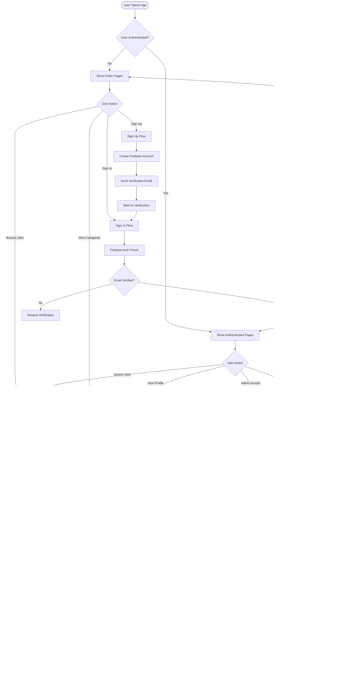

# Hirely Job Portal - UML Diagrams

## System Architecture Overview

---

## Class Diagram - Core Models

---

## Component Hierarchy Diagram

---

## Sequence Diagram - User Authentication Flow

---

## Sequence Diagram - Job Search Flow

---

## Sequence Diagram - Admin User Management

---

## State Diagram - User Authentication States

---

## Use Case Diagram

---

## Entity Relationship Diagram (Firebase Collections)

**Note:** The project currently does NOT store job data locally. Jobs are fetched from Reed API in real-time. The diagram shows the logical structure of external data.

---

## API Routes Architecture

---

## Deployment Architecture

---

## Data Flow Diagram - Complete System

---

## Technology Stack Diagram

---

## Security Architecture

---

## Future Enhancements - Planned Architecture

---

## Summary

This comprehensive UML documentation covers:

1. **System Architecture** - High-level component overview
2. **Class Diagram** - Core data models and relationships
3. **Component Hierarchy** - React component structure
4. **Sequence Diagrams** - Authentication, job search, and admin flows
5. **State Diagram** - User authentication lifecycle
6. **Use Case Diagram** - Actor interactions
7. **ERD** - Database/data structure (Firebase & External)
8. **API Routes** - Backend endpoint architecture
9. **Deployment Architecture** - Hosting and service integration
10. **Data Flow** - Complete user journey flows
11. **Technology Stack** - All frameworks and libraries
12. **Security Architecture** - Current security measures
13. **Future Enhancements** - Planned features and architecture

### Key Architectural Highlights:

- **Serverless Architecture**: Built on Next.js with API routes
- **Firebase-First**: Authentication and user management via Firebase
- **External Data**: Job data sourced from Reed API (not stored locally)
- **React Context**: Centralized authentication state management
- **Type-Safe**: Full TypeScript implementation
- **Component-Driven**: Reusable UI components with Tailwind CSS

### Recommended Improvements:

1. Add persistent job storage in Firestore
2. Implement proper admin authorization middleware
3. Add rate limiting to API routes
4. Move Reed API key to environment variables
5. Implement application tracking functionality
6. Add comprehensive error boundaries
7. Create user profile management system
